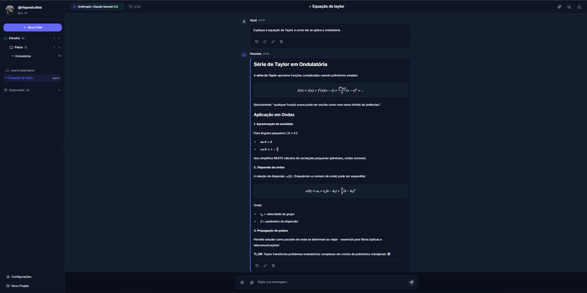

# Haumea 🌌

**Haumea** é uma plataforma de inteligência artificial open-source, moderna e multimodal, projetada para revolucionar a interação com o conhecimento. Construída com **Next.js 15** e **Firebase**, ela oferece uma experiência de chat robusta, personalizável e segura, integrando múltiplos modelos de IA de ponta através do **OpenRouter**.



## ✨ Funcionalidades em Destaque

### 🧠 Modos de Interação Inteligentes
*   **Chat Livre**: Converse naturalmente com acesso a múltiplos modelos de IA (GPT-4, Claude 3.5, Llama 3, etc.).
*   **Modo Estudo Guiado**: Um assistente pedagógico que estrutura o aprendizado passo a passo, cria planos de estudo e verifica o entendimento.
*   **Modo Debate**: Sistema avançado onde a IA assume uma persona para debater tópicos complexos, desafiando suas ideias com argumentos estruturados e lógica rigorosa.
*   **Personas Personalizáveis**: Crie e gerencie personas com instruções de sistema específicas (ex: "Professor de Física", "Revisor de Código", "Escritor Criativo").

### 🚀 Tecnologia e Performance
*   **BYOK (Bring Your Own Key)**: Total liberdade e controle de custos. Use sua própria chave API do OpenRouter.
*   **Streaming em Tempo Real**: Respostas geradas token a token para uma experiência fluida.
*   **Suporte Multimodal**:
    *   **Áudio**: Gravação de voz e transcrição automática (Whisper).
    *   **Imagens**: Análise e interpretação de imagens (Vision).
    *   **Arquivos**: Upload e análise de documentos PDF e texto.
*   **Incognito Mode**: Converse sem salvar histórico local ou na nuvem.

### 🎨 Visualização Avançada
*   **Markdown Rico**: Formatação completa de texto, tabelas e listas.
*   **Matemática (KaTeX)**: Renderização perfeita de equações LaTeX complexas ($E=mc^2$).
*   **Química (OpenChemLib)**: Visualização interativa de moléculas 2D e 3D via SMILES.
*   **Gráficos (Plotly)**: Geração automática de gráficos de dados interativos (barras, linhas, dispersão).
*   **Diagramas (Mermaid)**: Renderização de fluxogramas, diagramas de sequência e muito mais.
*   **Code Blocks**: Realce de sintaxe para dezenas de linguagens de programação com botão de cópia rápida.

### 🛠️ Ferramentas de Produtividade
*   **Gestão de Pastas**: Organize seus chats em pastas personalizadas.
*   **Pesquisa Inteligente**: Busque em todo o seu histórico de conversas.
*   **Compartilhamento**: Crie links públicos para compartilhar conversas interessantes.
*   **Exportação**: Baixe suas conversas em formatos Markdown, JSON ou PDF.
*   **Temas**: Alterne entre modo claro e escuro com um clique.

---

## 🏗️ Arquitetura e Stack Tecnológico

O projeto segue uma arquitetura **Serverless** moderna, garantindo escalabilidade e baixo custo de manutenção.

### Frontend (Client-Side)
*   **Framework**: [Next.js 15](https://nextjs.org/) (App Router)
*   **Linguagem**: TypeScript
*   **UI Library**: [React 19](https://react.dev/)
*   **Estilização**: Tailwind CSS + Framer Motion (animações)
*   **Ícones**: Lucide React
*   **Gerenciamento de Estado**: React Context API (`AuthContext`, `ThemeContext`, `DashboardContext`)

### Backend (Serverless)
*   **Runtime**: Firebase Cloud Functions (Node.js 18/20)
*   **Banco de Dados**: Firestore (NoSQL, Real-time)
*   **Autenticação**: Firebase Auth (Email/Senha, Google, GitHub)
*   **Storage**: Firebase Storage (Upload de arquivos e áudios)

### Integrações de IA
*   **Provedor Principal**: [OpenRouter API](https://openrouter.ai/)
*   **Modelos Suportados**: Acesso a todo o catálogo do OpenRouter (OpenAI, Anthropic, Meta, Mistral, Google, etc.)
*   **Transcrição**: OpenAI Whisper (via API)

---

## 📂 Estrutura do Projeto

```
haumea/
├── app/                        # Rotas e Páginas (Next.js App Router)
│   ├── (auth)/                 # Rotas de autenticação (login, registro)
│   ├── admin/                  # Painel administrativo
│   └── page.tsx                # Página principal (Dashboard)
├── components/                 # Componentes React Reutilizáveis
│   ├── admin/                  # Componentes do painel admin
│   ├── common/                 # Botões, inputs, toasts, ícones
│   ├── dashboard/              # Componentes do chat (Input, Sidebar, Mensagens)
│   │   ├── AudioRecorder.tsx   # Gravador de voz
│   │   ├── ChatInterface.tsx   # Área principal de chat
│   │   └── DebateInterface.tsx # Interface específica para debates
│   └── modals/                 # Todos os modais da aplicação
├── contexts/                   # Gerenciamento de Estado Global
│   ├── AuthContext.tsx         # Sessão do usuário
│   └── ThemeContext.tsx        # Tema Claro/Escuro
├── haumea-functions/           # Backend (Firebase Cloud Functions)
│   ├── src/
│   │   ├── functions/          # Definição das funções serverless
│   │   ├── middleware/         # Autenticação, CORS, Rate Limit
│   │   └── services/           # Lógica de negócios (OpenRouter, Firestore)
├── hooks/                      # Custom React Hooks
│   ├── useAudioRecorder.ts     # Lógica de gravação
│   ├── useChatData.ts          # Gerenciamento de mensagens
│   └── useDebateMode.ts        # Lógica do modo debate
├── lib/                        # Utilitários e Configurações
│   ├── db/                     # Camada de cache (IndexedDB)
│   ├── services/               # Serviços de frontend (ChatService, AudioService)
│   └── utils/                  # Funções auxiliares (formatação, criptografia)
└── public/                     # Assets estáticos
```

---

## ☁️ Funções do Backend (Cloud Functions)

O backend é composto por micro-serviços independentes hospedados no Firebase:

| Função | Descrição |
|--------|-----------|
| `chatWithAI` | Core do chat. Processa mensagens, gerencia histórico e conecta ao OpenRouter. |
| `debateMode` | Gerencia a lógica de turnos e personas do modo debate. |
| `transcriptionManager` | Recebe áudio, processa e retorna transcrição (Whisper). |
| `apiKeysManager` | Gerencia criptografia e armazenamento seguro de chaves de API dos usuários. |
| `adminManager` | Funções restritas para administração do sistema. |
| `openRouterCredits` | Consulta saldo e créditos da conta OpenRouter. |
| `saveEndpoint` | Salva configurações de endpoints personalizados. |
| `deleteUserAccount` | Remove todos os dados de um usuário (GDPR compliance). |

---

## 🚀 Guia de Instalação

### Pré-requisitos
*   **Node.js** (v18+)
*   **NPM** ou **Yarn**
*   **Firebase CLI** (`npm install -g firebase-tools`)
*   Conta no **Firebase** e **OpenRouter**

### 1. Clonar o Repositório
```bash
git clone https://github.com/seu-usuario/haumea.git
cd haumea
```

### 2. Instalar Dependências
Instale as dependências do frontend e do backend:

```bash
# Frontend
npm install

# Backend
cd haumea-functions
npm install
cd ..
```

### 3. Configurar Firebase
1.  Crie um projeto no [Firebase Console](https://console.firebase.google.com/).
2.  Habilite **Authentication**, **Firestore**, **Functions** e **Storage**.
3.  Login no CLI:
    ```bash
    firebase login
    ```
4.  Inicialize o projeto:
    ```bash
    firebase init
    ```
    *   Selecione: Firestore, Functions, Hosting, Storage.
    *   Use o projeto criado anteriormente.

### 4. Variáveis de Ambiente

#### Frontend (`.env.local`)
Copie o arquivo de exemplo:
```bash
cp .env.example .env.local
```
Preencha com as credenciais do seu projeto Firebase (disponíveis nas configurações do projeto no console).

#### Backend (`haumea-functions/.env`)
Copie o arquivo de exemplo:
```bash
cp haumea-functions/.env.example haumea-functions/.env
```

**🔐 Segurança Crítica:**
Você precisa gerar uma chave de criptografia hexadecimal de 32 bytes para proteger as API Keys dos usuários no banco de dados.
```bash
# Gerar chave aleatória
openssl rand -hex 32
```
Cole o valor gerado em `ENCRYPTION_KEY` no arquivo `.env`.

### 5. Deploy das Regras de Segurança
Para garantir a segurança do banco de dados e arquivos:
```bash
firebase deploy --only firestore:rules,storage:rules
```

### 6. Executar Localmente
```bash
npm run dev
```
Acesse: `http://localhost:3000`

---

## 📦 Deploy em Produção

Para publicar a aplicação completa (Frontend + Backend):

```bash
npm run deploy
```

Isso irá:
1.  Buildar o frontend Next.js (exportação estática).
2.  Compilar as funções TypeScript do backend.
3.  Fazer upload para o Firebase Hosting e Cloud Functions.

---

## 🛡️ Segurança e Privacidade

*   **Criptografia AES-256**: As chaves de API dos usuários são criptografadas antes de serem salvas no banco de dados.
*   **Relação Direta**: No modo BYOK, a comunicação é feita através do seu proxy, mas você detém o controle total da chave.
*   **Regras de Firestore**: Acesso a dados estritamente segregado por ID de usuário.
*   **Sanitização**: Todo input/output HTML é sanitizado para prevenir XSS.

---

## 🤝 Contribuição

Contribuições são bem-vindas! Sinta-se à vontade para abrir Issues ou Pull Requests.

1.  Faça um Fork do projeto
2.  Crie sua Feature Branch (`git checkout -b feature/MinhaFeature`)
3.  Commit suas mudanças (`git commit -m 'Adiciona MinhaFeature'`)
4.  Push para a Branch (`git push origin feature/MinhaFeature`)
5.  Abra um Pull Request

---

## 📄 Licença

Este projeto está licenciado sob a licença **MIT** - veja o arquivo [LICENSE](LICENSE) para detalhes.

---

Desenvolvido com ❤️ para a comunidade Open Source.
